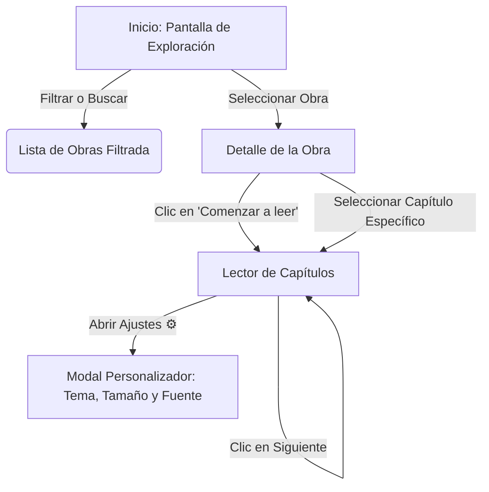

# ReadInn — Visión de Producto y Sistema de Diseño Visual

---

## 1. ¿Qué es ReadInn?

**ReadInn** es una plataforma abierta e independiente de **lectura y publicación de web fiction (novelas, relatos y series independientes)** en español y multilingüe. Nace como una alternativa moderna, limpia y ética a plataformas masivas como Wattpad, enfocada en ofrecer:

- **Para los Lectores**: Una experiencia de lectura **inmersiva, sin publicidad invasiva, 100% personalizable** (temas claro, sepia, oscuro, noche, fuentes configurables) y ligera tanto en móviles como en web.
- **Para los Escritores**: Un entorno de creación profesional con **editor distraction-free, guardado automático contra pérdidas, analíticas de retención reales** y control absoluto sobre sus obras y donaciones directas.

---

## 2. Pilares de la Experiencia Visual (UX/UI)

### 🎨 1. Estética Editorial Premium y Moderna
- **Estilo**: Clean Editorial & Minimalist Modern. 
- **Inspiración**: La elegancia de las editoriales de libros combinada con el dinamismo de las apps de contenido de vanguardia (Apple Books, Medium, Notion).
- **Enfoque en la portada**: Las obras destacan mediante portadas con sombras suaves, bordes redondeados y gradientes armónicos.

### 📖 2. Lectura Inmersiva y Cero Distracciones
- **Diseño del Lector**: Columnas de lectura con ancho máximo controlado (760px), interlineado generoso (1.6x) y controles flotantes/modales que desaparecen durante la lectura.
- **Modos de Iluminación**:
  - ☀️ **Claro**: Fondo `0xFFF8FAFC`, texto slate oscuro (`0xFF0F172A`).
  - 📜 **Sepia**: Fondo cálido papel envejecido (`0xFFFBF0D9`), texto sepia profundo (`0xFF432818`).
  - 🌙 **Oscuro**: Fondo slate nocturno (`0xFF0F172A`), texto blanco suave (`0xFFF8FAFC`).
  - 🌑 **Noche (OLED)**: Fondo negro puro (`0xFF000000`), texto gris de alto contraste (`0xFFE0E0E0`).

### ⚡ 3. Identidad de Marca y Paleta de Colores

| Concepto | Código HEX | Uso |
| :--- | :--- | :--- |
| **Primary Indigo** | `#6366F1` | Color distintivo de marca, botones principales, insignias de acción |
| **Primary Dark** | `#4F46E5` | Estados hover/pressed, bordes acentuados |
| **Accent Gold** | `#F59E0B` | Calificaciones, elementos destacados, insignias de contenido maduro/popular |
| **Slate Dark (Bg)** | `#0F172A` | Fondo principal en modo oscuro / encabezados de contraste |
| **Paper Warm (Sepia)**| `#FBF0D9` | Fondo del modo de lectura Sepia clásico |
| **Surface Light** | `#FFFFFF` | Tarjetas y contenedores sobre fondo neutro |

### 🔤 4. Tipografía Flexible
- **Titulares e Interfaz**: *Inter* (Limpia, moderna, legible en cualquier resolución).
- **Lector Elegible por el Usuario**:
  - 🏛️ **Serif**: *Merriweather* (Sensación de libro físico clásico).
  - 📱 **Sans-Serif**: *Inter* (Lectura moderna y limpia).
  - 💻 **Monospace**: *JetBrains Mono* (Estilo técnico o experimental).

---

## 3. Arquitectura de Pantallas del Sistema Visual

### 📱 1. Pantalla de Exploración (`ExploreScreen`)
- **Header con Identidad**: Logo `ReadInn` con ícono de libro estilizado y tagline descriptivo.
- **Buscador en Tiempo Real**: Campo de búsqueda con icono de lupa y botón para limpiar.
- **Barra de Géneros (Filter Chips)**: Scroll horizontal interactivo para filtrar rápidamente entre *Misterio, Ciencia ficción, Fantasía, Romance, Terror, Drama*.
- **Grid / Lista Adaptable**:
  - En móviles: Tarjetas verticales compactas.
  - En Web/Tablets: Grid responsivo de 2 a 3 columnas.
- **Tarjetas de Obra**: Portada con color de acento o imagen, título en negrita, nombre del autor con icono, síntesis a 2 líneas, conteo de capítulos e insignia `+18` si aplica.

### 📚 2. Detalle de la Obra (`StoryDetailScreen`)
- **Hero Banner**: Encabezado en gradiente generado con el color predominante de la portada.
- **Portadón 3D**: Portada en relieve con sombras suaves.
- **Metadatos Clave**: Autor, género, estado (Publicada / Completada) y número de capítulos.
- **CTA Principal**: Botón prominente *"Comenzar a leer"* en color Indigo con icono de reproducción.
- **Tarjeta de Sinopsis**: Texto de presentación amplio y bien espaciado.
- **Lista de Capítulos**: Lista ordenada con avatar de posición (1, 2, 3...) e indicadores visuales.

### 📖 3. Lector de Capítulos (`ReaderScreen`)
- **App Bar Flotante**: Muestra título de la obra, posición del capítulo y botón de ajustes ⚙️.
- **Contenido del Capítulo**: Texto maquetado con párrafos espaciados y tipografía personalizable.
- **Modal de Ajustes del Lector**:
  - Selector táctil de 4 temas (*Claro, Sepia, Oscuro, Noche*).
  - Control deslizante y botones (+/-) para ajustar tamaño de fuente de 14pt a 28pt.
  - Selector de familia tipográfica (*Serif, Sans-Serif, Monospace*).
- **Navegador Inferior**: Botones *"Capítulo Anterior"* y *"Siguiente Capítulo"*.

### ✍️ 4. Módulo del Escritor (Siguiente Fase Visual)
- **Panel "Mis Obras"**: Dashboard con tarjetas de borradores y obras publicadas.
- **Editor Distraction-Free**: Lienzo limpio de escritura con guardado automático (*autosave*) y contador de palabras en tiempo real.
- **Dashboard de Analíticas**: Gráficos de lecturas por capítulo y retención de lectores.

---

## 4. Flujo de Experiencia del Usuario

